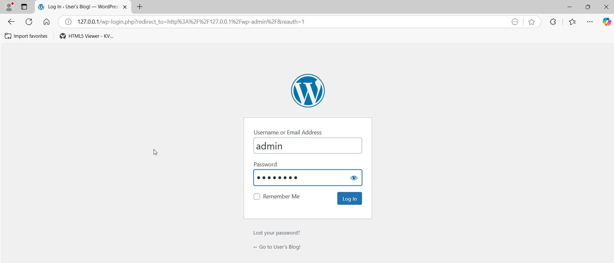

# SPDX-FileCopyrightText: (C) 2025 Intel Corporation
# SPDX-License-Identifier: Apache-2.0

# Using SEN from development machine

This guide provides information on how the developer machine can be used to interact with the Standalone Edge Node. This guide does not provide detail on how the networking should be achieved to access the Edge Node - it is assumed that the development machine and Edge Node are on the same network and there is no obstacles in communication.

## Preparing development machine

In this example the developer machine used is `Windows 11` laptop running behind a VPN on a corporate network. The Edge Node is present in the lab. `Windows PowerShell` is used as an interface to run command. Specific files are edited in `notepad` by accessing from a filesystem.

### Install `kubectl`

1. Install kubectl on the system
   
```shell
PS C:\Users\user> winget install -e --id Kubernetes.kubectl
PS C:\Users\user> cd ~
PS C:\Users\user> mkdir .kube
PS C:\Users\user> cd .kube
PS C:\Users\user> New-Item config -type file
```

2. Copy Kubeconfig from Edge Node at `/etc/rancher/k3s/k3s.yaml` into the development machine filesystem and save the content under `C:\Users\user\.kube\config`

```shell
 PS C:\Users\user> scp -o MACs=hmac-sha2-512-etm@openssh.com user@<EN IP>:/etc/rancher/k3s/k3s.yaml C:\Users\user\.kube\config
```

3. Edit the IP of the Edge Node in `C:\Users\user\.kube\config` from `localhost` to the actual IP of the Standalone Edge Node.

```shell
PS C:\Users\user> (Get-Content -Path "C:\Users\user\.kube\config") -replace "127\.0\.0\.1", "<EN IP>" | Set-Content -Path "C:\Users\user\.kube\config"
```

```diff
-    server: https://127.0.0.1:6443
+    server: https://<EN IP>:6443
```

4. Run `kubectl` tool to test connection

```shell
PS C:\Users\user> kubectl get pods -A
```

### Install `Helm`

Install `Helm` on developer machine

```shell
PS C:\Users\user> winget install Helm.Helm
```
If behind proxy export proxy settings before running `helm` commands

```shell
PS C:\Users\user> $env:HTTPS_PROXY="http://<PROXY_ADDRESS>:<PORT>"
PS C:\Users\user> $env:HTTP_PROXY="http://<PROXY_ADDRESS>:<PORT>"
PS C:\Users\user> $env:NO_PROXY="<EN-IP>"
```

## Installing WordPress Application

WordPress application can be used as a test application.

1. Add `bitnami` repo to helm

```shell
PS C:\Users\user> helm repo add bitnami https://charts.bitnami.com/bitnami
```

2. Create a value override file `values-wp.yaml`

```yaml
mariadb:
  primary:
    persistence:
      enabled: false
  auth:
    password: password
    rootPassword: secretpassword
wordpressUsername: admin
wordpressPassword: password
persistence:
  enabled: false
resources:
  requests:
    cpu: 0m
    memory: 0Mi
service:
  type: ClusterIP
  annotations:
    service-proxy.app.orchestrator.io/ports: "80"
    external-dns.alpha.kubernetes.io/hostname: "wordpress.example.org"
```

3. Install WordPress via helm

```shell
PS C:\Users\user> helm install my-wordpress bitnami/wordpress --namespace wordpress --create-namespace -f .\values-wp.yaml --version 19.4.3
```

4. Apply network policy for `wordpress` namespace create a file `wp-net-policy.yaml` and apply.

```yaml
apiVersion: networking.k8s.io/v1
kind: NetworkPolicy
metadata:
  name: wordpress-egress
  namespace: wordpress
spec:
  egress:
  - {}
  policyTypes:
  - Egress
---
apiVersion: networking.k8s.io/v1
kind: NetworkPolicy
metadata:
  name: wordpress-ingress
  namespace: wordpress
spec:
  ingress:
  - {}
  podSelector: {}
  policyTypes:
  - Ingress
```

```shell
PS C:\Users\user> kubectl apply -f wp-net-policy.yaml
```

5. View the pods running

```shell
PS C:\Users\user> kubectl get pods -n wordpress
NAME                           READY   STATUS    RESTARTS       AGE
my-wordpress-d57b44f9c-lw69m   1/1     Running   3 (3m4s ago)   10m
my-wordpress-mariadb-0         1/1     Running   0              10m
```

6. Forward port to be able to access WP 

```shell
PS C:\Users\user> kubectl port-forward --namespace wordpress svc/my-wordpress 8080:443 --address=0.0.0.0
```

7. Access the WP blog from browser using `http://localhost:8080/admin` URL.



8. Login using the `admin` (login) and `password` (password) credentials


