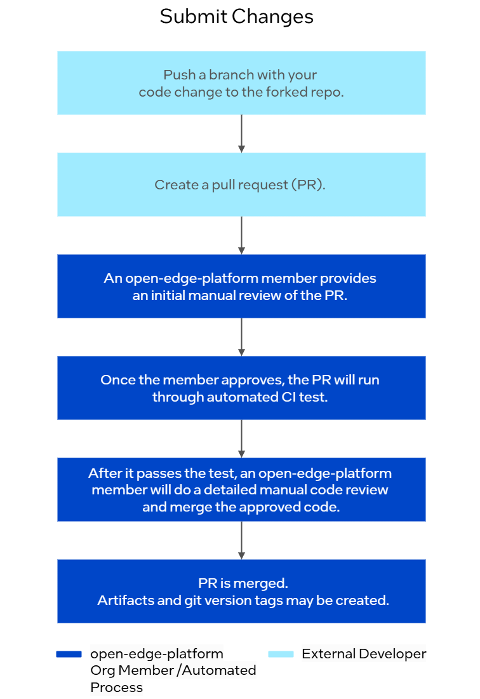

# Contribute to Edge Microvisor Toolkit Standalone Node

Edge Microvisor Toolkit Standalone Node is open source and always welcomes an active
community to support adding new features, optimizing, and improving security.

## Areas for Contribution

The current release of the Intel® Edge Microvisor Toolkit Standalone Node supports the creation of bootable USB drives 
on Linux-based operating systems. This capability opens up several avenues for contribution:

USB-Based Provisioning: Improve and optimize the process for creating bootable USB drives and
develop tools and scripts that streamline the provisioning of the Standalone Node

Feature Development: Innovate by adding new features or enhancing existing microvisor image to support more complex use cases.
Kubernetes RKE2 clusters along with cluster extensions to enhance scalability, manageability, and orchestration capabilities

Empowerment for Enterprise Customers and Developers:
Provides the tools and infrastructure needed to explore and implement Edge AI solutions, empowering users 
to leverage Intel's architecture for advanced edge computing applications.

## New Features

New feature requests should always be made by opening an Architecture Decision Record (ADR)
GitHub issue, regardless of whether you want to contribute directly or just file a request.
To do so, use the [Design Proposal](TO DO :link to design proposal for SN) template
and provide as much information as possible. This helps maintainers and stakeholders to
review, better understand, and prioritize the request.

## Contribution Flow

The following diagram outlines the general workflow for pull requests made
to the Edge Microvisor Toolkit Standalone Node repository:

## Release Cadence

The Intel® Edge Microvisor Toolkit Standalone Node follows a regular release schedule, with updates every few weeks. 
Contributions are reviewed and integrated based on priority and alignment with upcoming releases.

## Contribution license

Since Edge Microvisor Toolkit Standalone Node is open source, by contributing to the project, you agree that
your contributions will be licensed under the terms stated in the
[LICENSES](../../LICENSES) file.
