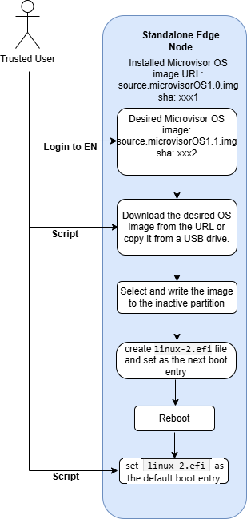

# Design Proposal: A/BUpdate of Edge Microvisor Toolkit - Standalone (EMT-S)

Author(s): Edge Infrastructure Manager Team

Last updated: 06/20/2025

## Abstract

This document is a design proposal for the A/B Partition Day 2 update of an Edge Node (EN) with an immutable EMT image.
This design proposal aims to enhance the EMT image update process for edge nodes, ensuring that new features can be
delivered without requiring end users to reinstall their software.

## Proposal

The immutable EMT image is being updated with a new immutable EMT image at the image level.
To achieve this, two read-only partitions will be created: the A and B partitions.The A partition will persist
the original EMT image installation, and the B partition will be used to install a new EMT image.
Depending on the success of the updated EMT installation, the EMT will boot from the new partition (B) or
roll back to the original partition (A) in case of failure.

## Rationale

We are developing a new script that invokes the os-update-tool, rather than modifying and expanding the
os-update-tool itself to include the functionality needed for pulling an image and executing the update.
And the scope of this is only for EMT immutable images. This process and tool does not support EMT mutable images.

## Implementation Plan

- First, create a unique directory using the mktemp command
  `TEMP_DIR=$(mktemp -d)`
- Use the `mount` command to mount the USB drive to the temporary directory
  Example:
  `sudo mount /dev/sdb1 "$TEMP_DIR"`

To perform the A/B upgrade procedure for an immutable EMT image, follow the steps below:

**Step 1:** Admin logs in to the EMT-S edge node and executes the script located at `/etc/cloud/emt-img-update.sh`.
This script is responsible for initiating the EMT image update process.

**Step 2:** `/etc/cloud/emt-img-update.sh` requires two arguments:

- The URL or USB mount path where the desired EMT image is located.
- The URL or USB mount path for the SHA file corresponding to the EMT image, which is used for integrity verification.

**Sample commands:**  

- Direct Path Command:
`emt-img-update.sh -i /$TEMP_DIR/edge-readonly-3.0.20250518.2200-signed.raw.gz -c /$TEMP_DIR/edge-readonly-3.0.20250518.2200-signed.raw.gz.sha256sum`
`emt-img-update.sh /home/user/edge-readonly-3.0.20250518.2200-signed.raw.gz /home/user/edge-readonly-3.0.20250518.2200-signed.raw.gz.sha256sum`
- URL Command:
`emt-img-update.sh -u <url_to_emt_image> <url_to_sha_file>`

**Step 3:** The script `/etc/cloud/emt-image-update.sh` invokes another script `/usr/bin/os-update-tool.sh` to perform the
actual update procedure.

- Execute the update tool script with the write command to write into the inactive partition:  
  `os-update-tool.sh -w -u <file_path_to_EMT_image> -s <check_sum_value>`
- Execute the update tool with the apply command to set the newly written image to be used for the next boot:  
  `os-update-tool.sh -a`

**Step 4:**  The `os-update.sh` script creartes a default user after the EMT image update, which is accomplished by modifying the
cloud configuration file.

> **Note:** In this release, we configure cloud-init to create **only** default user.

**Step 5:** Reboot - Restart the system to boot from the newly applied EMT image.

**Step 6:** Upon successful boot, verify that the system is running correctly with the new image:

- `sudo bootctl list`
  `sudo cat /etc/lsb-release`

- Make the new image persistent for future boots using the following command:  
  `os-update-tool.sh -c`

> **Note:** Step 6 is the only step that can be integrated into the cloud-init script.

## Test Plan

Following tests have been planned to verify this feature

1. Update the Edge Node with the latest version of the EMT image
2. Update the Edge Node with the older version of the EMT image
3. Provision the EN with a specific profile (EMT-NRT) that includes k3s and Docker, and then update the EMT
   image.
4. Test the system's ability to handle unexpected or incorrect EMT image versions and its fallback mechanism
