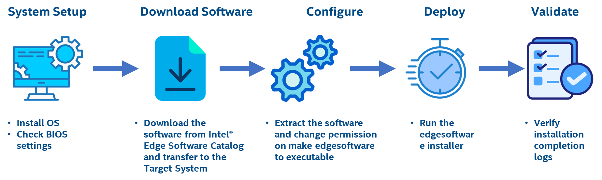
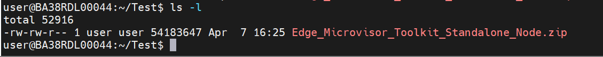
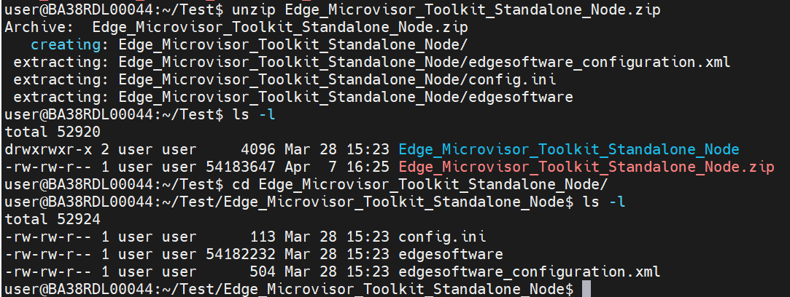
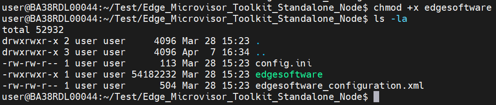
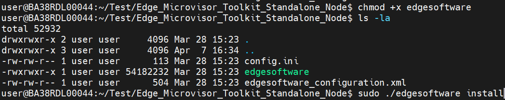

# Get Started

The installation flow for Intel® Edge Microvisor Toolkit Standalone Node – Edge Software Hub is primarily intended for Public / External users. The Edge Microvisor Toolkit Standalone Node Software is installed through ESC QA (Edge Software Hub). The user logs in to ESC, selects the released package, and can download the installer package. 
The user extracts and copies the EN install package to the target systems and executes the installer to support Standalone USB based edge node installation of Edge Microvisor Toolkit.
The installation of the Edge Microvisor  Toolkit should also include installation of Kubernetes, all necessary Kubernetes extensions (device plugins, scheduler extensions, CNIs, CSIs, etc). Ultimately the standalone EN based on Edge Microvisor Toolkit should support customers to deploy their workloads in an independent standalone cluster. Once the customer completes the evaluation the customer should be able to onboard this EN to the backed as part of the product deployment.

> NOTE: The software update to the Foundation Edge Nodes is done manually by downloading an Intel updated version of a given Edge Microvisor Toolkit Standalone Node package, hence there is no automatic update process of Edge Nodes in this scenario.

## Installation Process for Intel® Edge Microvisor Toolkit Standalone Node


*<center>Figure 1: Flow for Intel® Edge Microvisor Toolkit Standalone Node</center>*

## Step 1: Prerequisites & System Set-UP

Before starting the Edge Node deployment, perform the following steps:-

- System bootable to a fresh Ubuntu 22.04.
- Internet connectivity is available on the Node
- The target node(s) hostname must be in lowercase, numerals, and hyphen’ – ‘. 
  - For example: wrk-8 is acceptable; wrk_8, WRK8, and Wrk^8 are not accepted as hostnames.
- Required proxy settings must be added to the /etc/environment file.
- Get access to the Edge Software Hub portal.

## Step 2: Download the ESC Package

1. Select Configure & Download to download the Intel® Edge Microvisor Toolkit Standalone Node package. <br>
<a href="https://edge-services-catalog-prod-qa.apps1-bg-int.icloud.intel.com/package/edge_microvisor_toolkit_standalone_node" style="display: inline-block; padding: 10px 20px; font-size: 16px; font-weight: bold; color: white; background-color: #007bff; text-align: center; text-decoration: none; border-radius: 5px; border: none;">Configure & Download</a>

## Step 3: Configure

The ESC Package will be downloaded on your Local System in a zip format, labeled as “Edge_Microvisor_Toolkit_Standalone_Node.zip”.

1. Copy the ESC package from the Local System to a Edge Node running Ubuntu 22.04 <br>
   mkdir Test <br>
   chmod 750 Test <br>
    <br>
   *<center>Figure 6: Copy ESC Package to Target System</center>* <br><br>
2. Proceed to extract the compressed file to obtain the ESC Installer.
   ```bash
   $ unzip Edge_Microvisor_Toolkit_Standalone_Node.zip
   ```
    <br>
   *<center>Figure 7: Unzip the ESC Package</center>* <br><br>
3. Navigate to the extracted folder & modify the permissions of the ‘edgesoftware’ file to make it executable.
   ```bash
   $ chmod +x edgesoftware
   ```

    <br>
   *<center>Figure 8: Change Installer Permission</center>* <br><br>

## Step 4:  Deploy

   Execute the ESC Installer to begin the installation process by using the following command.
   ```bash
   $ sudo ./edgesoftware install
   ```
    <br>

### 4.1 User Inputs Required for installtion
   <details>
   <summary><code>User Inputs</code> <code><b>Edge Microvisor Toolkit Standalone Node Package</b></code></summary>

   #### Parameters:-

   | Prompt                | User Input                                          |
   |-----------------------|-----------------------------------------------------|
   | HTTP Proxy            | Enter the HTTP proxy (leave blank for none)         |
   | HTTPS Proxy           | Enter the HTTPS proxy (leave blank for none)        |
   | No Proxy              | Enter the NO proxy (leave blank for none)           |
   | SSH Key               | Enter the SSH key                                   |
   | User Name             | Enter the user name                                 |
   | Password              | Enter the password                                  |
   | Disk                  | Enter the disk                                      |

   </details>

## Step 5:  Uninstall Edge Microvisor Toolkit Standalone Node Package

   - Navigate to the directory where ESC installer is extracted
   - Execute execute ./edgesoftware with uninstall option
   ```bash
   $ ./edgesoftware uninstall
   ```
