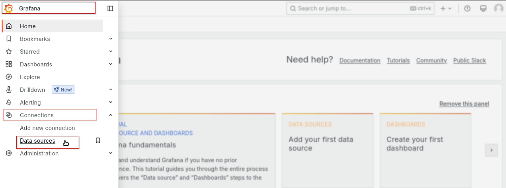
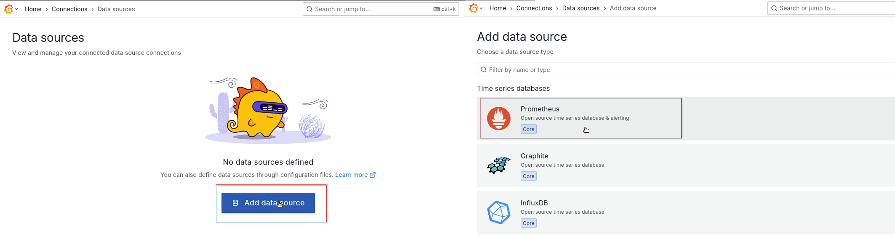
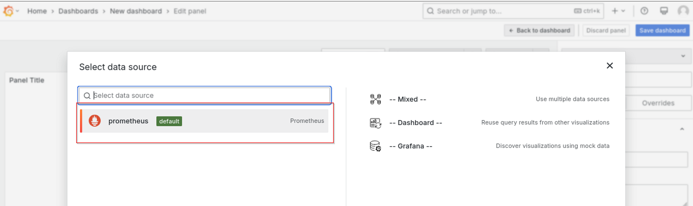
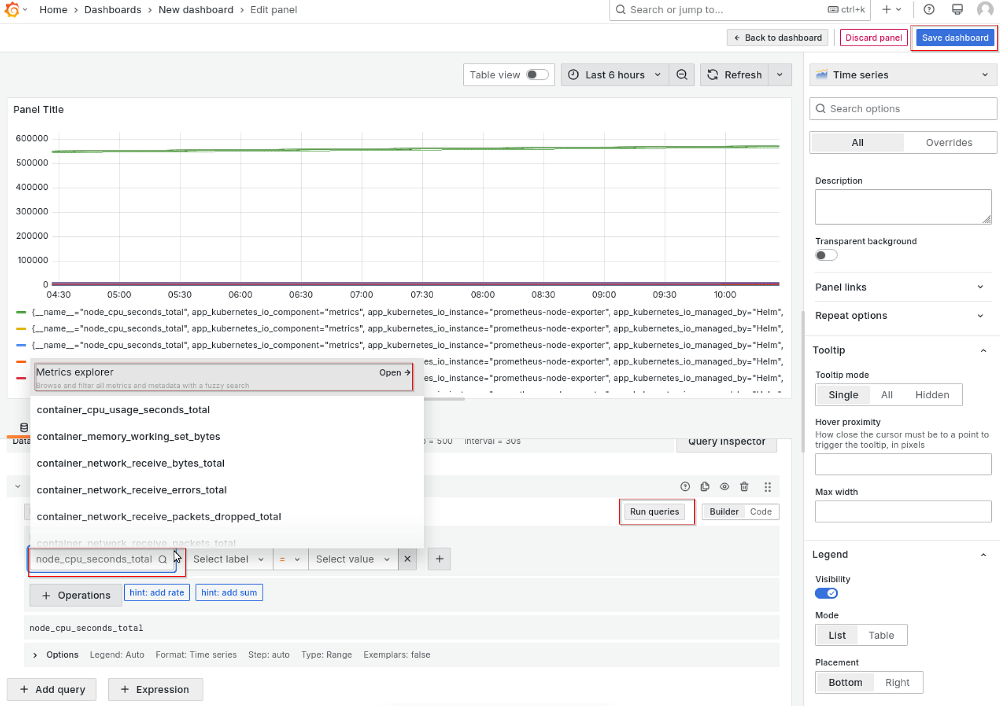

# Get Started

The installation flow for Intel® Edge Microvisor Toolkit Standalone Node – Edge Software Hub is primarily intended for Public / External users. The Edge Microvisor Toolkit Standalone Node Software is installed through ESC QA (Edge Software Hub). The user logs in to ESC, selects the released package, and can download the installer package. 
The user extracts and copies the EN install package to the target systems and executes the installer to support Standalone USB based edge node installation of Edge Microvisor Toolkit.
The installation of the Edge Microvisor  Toolkit should also include installation of Kubernetes, all necessary Kubernetes extensions (device plugins, scheduler extensions, CNIs, CSIs, etc). Ultimately the standalone EN based on Edge Microvisor Toolkit should support customers to deploy their workloads in an independent standalone cluster. Once the customer completes the evaluation the customer should be able to onboard this EN to the backed as part of the product deployment.

> NOTE: The software update to the Foundation Edge Nodes is done manually by downloading an Intel updated version of a given Edge Microvisor Toolkit Standalone Node package, hence there is no automatic update process of Edge Nodes in this scenario.

## Installation Process for Intel® Edge Microvisor Toolkit Standalone Node


*<center>Figure 1: Flow for Intel® Edge Microvisor Toolkit Standalone Node</center>*

## Step 1: Prerequisites & System Set-UP

Before starting the Edge Node deployment, perform the following steps:-

- System bootable to a fresh Ubuntu 22.04.
- Internet connectivity is available on the Node
- The target node(s) hostname must be in lowercase, numerals, and hyphen’ – ‘. 
  - For example: wrk-8 is acceptable; wrk_8, WRK8, and Wrk^8 are not accepted as hostnames.
- Required proxy settings must be added to the /etc/environment file.
- Get access to the Edge Software Hub portal.

## Step 2: Download the ESC Package

1. Select Configure & Download to download the Intel® Edge Microvisor Toolkit Standalone Node package. <br>
<a href="https://edge-services-catalog-prod-qa.apps1-bg-int.icloud.intel.com/package/edge_microvisor_toolkit_standalone_node" style="display: inline-block; padding: 10px 20px; font-size: 16px; font-weight: bold; color: white; background-color: #007bff; text-align: center; text-decoration: none; border-radius: 5px; border: none;">Configure & Download</a>

## Step 3: Configure

The ESC Package will be downloaded on your Local System in a zip format, labeled as “Edge_Microvisor_Toolkit_Standalone_Node.zip”.

1. Copy the ESC package from the Local System to a Edge Node running Ubuntu 22.04 <br>
   mkdir Test <br>
   chmod 750 Test <br>
    <br>
   *<center>Figure 6: Copy ESC Package to Target System</center>* <br><br>
2. Proceed to extract the compressed file to obtain the ESC Installer.
   ```bash
   $ unzip Edge_Microvisor_Toolkit_Standalone_Node.zip
   ```
    <br>
   *<center>Figure 7: Unzip the ESC Package</center>* <br><br>
3. Navigate to the extracted folder & modify the permissions of the ‘edgesoftware’ file to make it executable.
   ```bash
   $ chmod +x edgesoftware
   ```

    <br>
   *<center>Figure 8: Change Installer Permission</center>* <br><br>

## Step 4:  Deploy

   Execute the ESC Installer to begin the installation process by using the following command.
   ```bash
   $ sudo ./edgesoftware install
   ```

    <br>

### 4.1 User Inputs Required for installtion
   <details>
   <summary><code>User Inputs</code> <code><b>Edge Microvisor Toolkit Standalone Node Package</b></code></summary>

   #### Parameters:-

   | Prompt                | User Input                                          |
   |-----------------------|-----------------------------------------------------|
   | HTTP Proxy            | Enter the HTTP proxy (leave blank for none)         |
   | HTTPS Proxy           | Enter the HTTPS proxy (leave blank for none)        |
   | No Proxy              | Enter the NO proxy (leave blank for none)           |
   | SSH Key               | Enter the SSH key                                   |
   | User Name             | Enter the user name                                 |
   | Password              | Enter the password                                  |
   | Disk                  | Enter the disk                                      |

   </details>

## Step 5: Gain access to the Edge Node from a development machine

A developer machine can be used to interact with the Edge Node. It is assumed that the development machine and Edge Node are on the same network and there is no obstacles in communication.

In this example the developer machine used is `Windows 11` laptop. The Edge Node is present on the same network. `Windows PowerShell` is used as an interface to run commands. Specific files are edited in text editor by accessing from a filesystem.

> Note: The same functionality can be achieved in `Linux` environment by executing Linux equivalent commands.

## Step 6: Set up tools on development machine

Install and configure `kubectl` and `helm` tools on the developer machine

> Note: The user and disk used in developer machine must be replace throughout the commands provided in this tutorial.

> Note: The Edge Node IP address indicated by `<EN IP>` must be replaced throughout the tutorial

1. Install kubectl on the system
   
```shell
PS C:\Users\user> winget install -e --id Kubernetes.kubectl
PS C:\Users\user> cd ~
PS C:\Users\user> mkdir .kube
PS C:\Users\user> cd .kube
PS C:\Users\user> New-Item config -type file
```

2. Copy Kubeconfig from Edge Node at `/etc/rancher/rke2/rke2.yaml` into the development machine filesystem and save the content under `C:\Users\user\.kube\config`

```shell
 PS C:\Users\user> scp -o MACs=hmac-sha2-512-etm@openssh.com user@<EN IP>:/etc/rancher/rke2/rke2.yaml C:\Users\user\.kube\config
```

3. Edit the IP of the Edge Node in `C:\Users\user\.kube\config` from `localhost` to the actual IP of the Standalone Edge Node.

```shell
PS C:\Users\user> (Get-Content -Path "C:\Users\user\.kube\config") -replace "127\.0\.0\.1", "<EN IP>" | Set-Content -Path "C:\Users\user\.kube\config"
```

```diff
-    server: https://127.0.0.1:6443
+    server: https://<EN IP>:6443
```

4. Run `kubectl` tool to test connection

```shell
PS C:\Users\user> kubectl get pods -A
```

5. Install `Helm` on developer machine

```shell
PS C:\Users\user> winget install Helm.Helm
```
If behind proxy export proxy settings before running `helm` commands

```shell
PS C:\Users\user> $env:HTTPS_PROXY="http://<PROXY_ADDRESS>:<PORT>"
PS C:\Users\user> $env:HTTP_PROXY="http://<PROXY_ADDRESS>:<PORT>"
PS C:\Users\user> $env:NO_PROXY="<EN-IP>"
```

## Step 7: Setup K8s dashboard access

The Edge Node is installed with K8s dashboard that can be accessed by running following steps:

1. To view the K8s dashboard pods run:

```shell
PS C:\Users\user> kubectl get pods -n kubernetes-dashboard
```

2. Enable kube proxy

```shell
PS C:\Users\user> kubectl proxy
Starting to serve on 127.0.0.1:8001
```

  or following to run in background

```shell
PS C:\Users\user> Start-Process kubectl proxy
```

3. Generate access token

```shell
PS C:\Users\user> kubectl -n kubernetes-dashboard create token admin-user
<token>
```

4. Access the dashboard from browser at `http://localhost:8001/api/v1/namespaces/kubernetes-dashboard/services/https:kubernetes-dashboard:/proxy/#/login`


5. Login with the previously generated `<token>`


## Step 8: Install sample application

WordPress application can be used as a test application and this tutorial will cover the sample installation.

. Add `bitnami` repo to helm

```shell
PS C:\Users\user> helm repo add bitnami https://charts.bitnami.com/bitnami
```

> NOTE: The below credentials are for demonstration only.

2. Create a value override file `values-wp.yaml`

```yaml
mariadb:
  primary:
    persistence:
      enabled: false
  auth:
    password: password
    rootPassword: secretpassword
wordpressUsername: admin
wordpressPassword: password
persistence:
  enabled: false
resources:
  requests:
    cpu: 0m
    memory: 0Mi
service:
  type: ClusterIP
  annotations:
    service-proxy.app.orchestrator.io/ports: "80"
    external-dns.alpha.kubernetes.io/hostname: "wordpress.example.org"
```

3. Install WordPress via helm

```shell
PS C:\Users\user> helm install my-wordpress bitnami/wordpress --namespace wordpress --create-namespace -f .\values-wp.yaml --version 19.4.3
```

4. Apply network policy for `wordpress` namespace create a file `wp-net-policy.yaml` and apply.

> NOTE: This policy opens up all ingress and egress traffic in the namespace - tailor down the allowed traffic per needs of an application in non-test app deployments.

```yaml
apiVersion: networking.k8s.io/v1
kind: NetworkPolicy
metadata:
  name: wordpress-egress
  namespace: wordpress
spec:
  egress:
  - {}
  policyTypes:
  - Egress
---
apiVersion: networking.k8s.io/v1
kind: NetworkPolicy
metadata:
  name: wordpress-ingress
  namespace: wordpress
spec:
  ingress:
  - {}
  podSelector: {}
  policyTypes:
  - Ingress
```

```shell
PS C:\Users\user> kubectl apply -f wp-net-policy.yaml
```

5. View the pods running

```shell
PS C:\Users\user> kubectl get pods -n wordpress
NAME                           READY   STATUS    RESTARTS       AGE
my-wordpress-d57b44f9c-lw69m   1/1     Running   3 (3m4s ago)   10m
my-wordpress-mariadb-0         1/1     Running   0              10m
```

6. Forward port to be able to access WP 

```shell
PS C:\Users\user> kubectl port-forward --namespace wordpress svc/my-wordpress 80:80
```

7. Access the WP blog from browser using `http://127.0.0.1//admin` URL.


8. Login using the `admin` (login) and `password` (password) credentials


## Step 9: Accessing Grafana

Grafana is installed and used to access metrics form the Edge Node to access Grafana

1. Get the username and password

```shell
PS C:\Users\dkopyto\.kube> kubectl get secret grafana -n observability -o jsonpath="{.data.admin-user}" | % { [System.Text.Encoding]::UTF8.GetString([Convert]::FromBase64String($_)) }
```

```shell
PS C:\Users\dkopyto\.kube> kubectl get secret grafana -n observability -o jsonpath="{.data.admin-password}" | % { [System.Text.Encoding]::UTF8.GetString([Convert]::FromBase64String($_)) }
```

2. Access Grafana from browser at Edge Node IP and port `32000` and login using credentials

```shell
http://<EN IP>:32000
```


## Step 10: Adding Prometheus metrics to Grafana

Next you'll need the Prometheus TLS credentials.

**Note**: The following commands are in `powershell` but using ``base64 --decode`` on a Linux setup works just as well.

1. Get Prometheus credentials
```shell
PS C:\Users\user> $key=kubectl get secret -n observability prometheus-tls -o jsonpath="{['data']['tls\.key']}"
PS C:\Users\user> $cert=kubectl get secret -n observability prometheus-tls -o jsonpath="{['data']['tls\.crt']}"
PS C:\Users\user> $ca=kubectl get secret -n observability prometheus-tls -o jsonpath="{['data']['ca\.crt']}"
PS C:\Users\user> [Text.Encoding]::Utf8.GetString([Convert]::FromBase64String($key)) 
<key>
PS C:\Users\user> [Text.Encoding]::Utf8.GetString([Convert]::FromBase64String($cert)) 
<cert>
PS C:\Users\user> [Text.Encoding]::Utf8.GetString([Convert]::FromBase64String($ca)) 
<ca>
```

2. In Grafana navigate to ``connections/Data sources`` 



3. Add a new Prometheus data source.



4. Configure the data source, filling in the `ca`, `cert` and `key` gathered earlier. Set the `url` and `server name` as ``https://prometheus-prometheus.observability.svc.cluster.local:9090`` and save.


## Step 11: Querying Metrics

1. Create a dashboard using prometheus data source
   
   

2. Select the data source

  

3. Select metrics to query, use metric explorer to view available metrics. User `Run query` button to run queries. Build the required dashboard and save using the `Save dashboard` button.

  

## Step 12:  Uninstall Edge Microvisor Toolkit Standalone Node Package

   - Navigate to the directory where ESC installer is extracted
   - Execute execute ./edgesoftware with uninstall option
   ```bash
   $ ./edgesoftware uninstall
   ```
