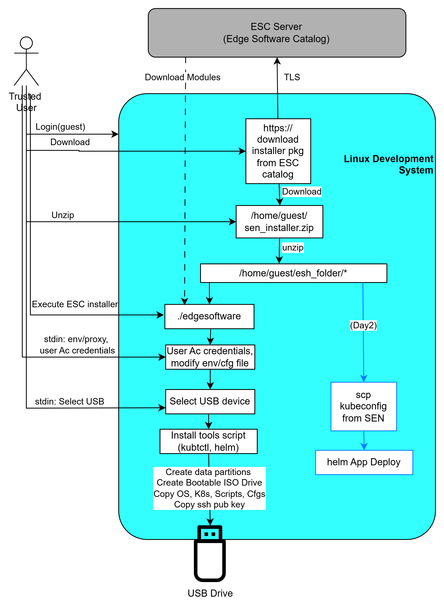
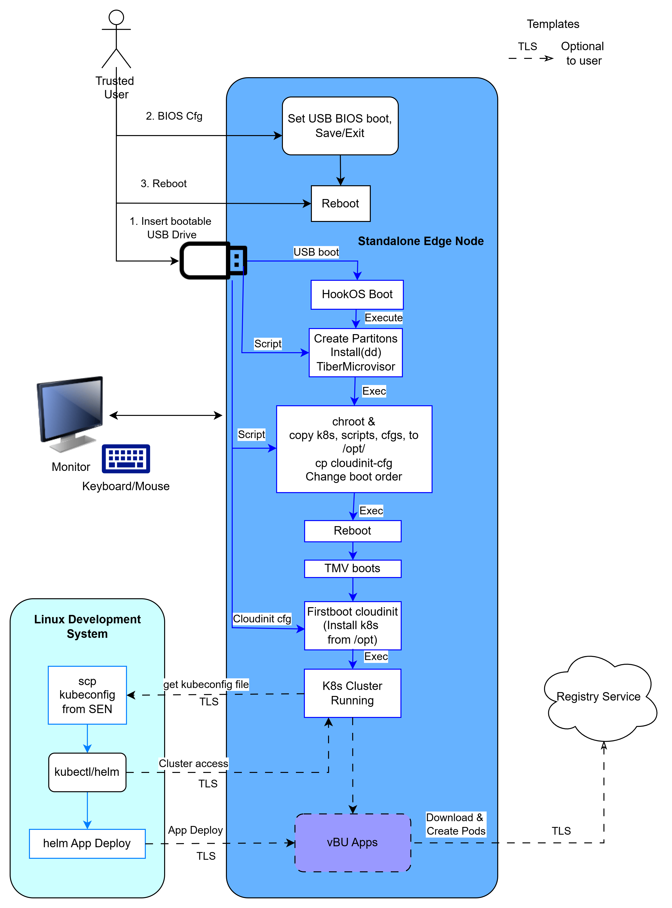

# Edge Microvisor Toolkit Standalone Node 

Provide ESC installer to support Standalone USB based edge node installation of Edge Microvisor Toolkit.

## Overview

The Edge Microvisor (formerly called Tiber OS) needs to support a standalone installation without requiring the ITEP controller (backend). The installation of the Edge Microvisor Toolkit should also include installation of Kubernetes, all necessary Kubernetes extensions (device plugins, scheduler extensions, CNIs, CSIs, etc). Ultimately the standalone EN based on Edge Microvisor Toolkit should support customers to deploy their workloads in an independent standalone cluster. Once the customer completes the evaluation the customer should be able to onboard this EN to the backed as part of the product deployment and scaling as described [here](https://edge-node.app.intel.com/docs/specs/adr-itep-en-imaging/#onboarding-a-pre-provisioned-edge-node).

The initial release needs to support a bare minimum set of features, where subsequent releases will include more value-added functionality such as local auth/authz, OIDC (Open-ID Connect) for federated identity and provisioning of enterprise rooted CAs (through certmgr) to secure the Kubernetes control plane.

## How It Works

The following outlines the key requirements for the initial release of a standalone edge stack based on Tiber Microvisor.

|ID| Requirement | Description | Priority |
|--------------|--------------|--------------|--------------|
|1|ISO non-interactive installation| The Tiber Microvisor must support installation without EN requiring keyboard/mouse/monitor to install OS, container runtime, K8s and basic cluster components like CNI and Observability| 3.0 |
|2|Immutable TiberOS|The Tiber Microvisor must be immutable and leverage the same production image used for ITEP so the EN can, at a later point in time with necessary onboarding utility, join an existing ITEP backend| 3.0 |
|3|Single node cluster|The standalone EN shall support creating a single node cluster (combined control- and worker node)| 3.0 |
|4|Setup utility (Optional)|A terminal based connection utility should be provided that the customer can run on their development system (on same subnet) that helps in (a) discovering the newly created EN w/ mDNS (b) installs `kubectl` and `helm` and (c) retrieves the `kubeconfig` over `scp` from the EN with default provisioned node credentials| 3.1 |
|5|EN access|Customer should be able to use cloud-native development and debug tools like `kubectl`, `helm` and `kubernetes dashboard` to access application and K8s cluster on the EN.| 3.0 |
|6|EN access|TiberOS install should create a user and enable `sshd` which will enable customer to remote login to the EN and copy the `kubeconfig`.| 3.0 |

## Linux Development Setup flow: (Day 0)

## Edge microvisor toolkit Standalone Node provisioning and Cluster Creation Flow (Day 1)

